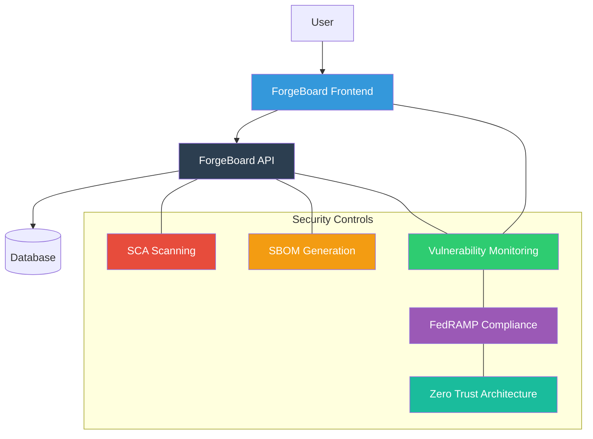

# 🛡️ ForgeBoard Security Policy

<div style="background-color: #e8f4f8; border-left: 5px solid #3498db; padding: 10px; margin-bottom: 20px;">
  <strong>Last Updated:</strong> June 15, 2025 | <strong>Document Version:</strong> 2.1.0
</div>

## 📋 Supported Versions

Currently supported versions of ForgeBoard applications with security updates:

| Application             | Latest Version | Supported |
| ----------------------- | -------------- | --------- |
| forge-board (workspace) | 1.0.0          | ✅        |
| forgeboard-frontend     | 1.0.0          | ✅        |
| forgeboard-api          | 1.0.0          | ✅        |
| shared-api-interfaces   | 1.0.0          | ✅        |

## 🔄 OSCAL Compliance

<div style="background-color: #f0f7f4; border-left: 5px solid #2ecc71; padding: 10px; margin-bottom: 15px;">
  <strong>Last Updated:</strong> May 28, 2025
</div>

Our OSCAL implementation is compatible with:

| Component         | Version | Status | Last Updated | Notes                                                                                                         |
| ----------------- | ------- | ------ | ------------ | ------------------------------------------------------------------------------------------------------------- |
| OSCAL Core        | 1.0.4   | ✅     | Mar 12, 2025 | <span style="background-color: #e8f4f8; border-radius: 3px; padding: 2px 6px;">🔄 ForgeBoard Certified</span> |
| TrueNorth Profile | 1.0.0   | ✅     | Jan 30, 2025 | <span style="background-color: #f0f7f4; border-radius: 3px; padding: 2px 6px;">✅ Full Compliance</span>      |
| FedRAMP Rev5      | Draft   | ✅     | May 15, 2025 | <span style="background-color: #fff8e1; border-radius: 3px; padding: 2px 6px;">🏛️ FedRAMP Update</span>       |
| NIST 800-53r5     | Final   | ✅     | Apr 23, 2025 | <span style="background-color: #fef6f6; border-radius: 3px; padding: 2px 6px;">🔒 Security Enhanced</span>    |

## 🔍 Security Architecture

<div style="background-color: #f9f0ff; border-left: 5px solid #9b59b6; padding: 10px; margin-bottom: 15px;">
  <strong>Last Updated:</strong> June 5, 2025 | <span style="background-color: #e8f4f8; border-radius: 3px; padding: 2px 6px;">🛠️ Architecture Update</span>
</div>



## 📝 Change History

<table style="width: 100%; border-collapse: collapse;">
  <thead style="background-color: #f8f9fa;">
    <tr>
      <th style="padding: 10px; text-align: left; border: 1px solid #ddd;">Date</th>
      <th style="padding: 10px; text-align: left; border: 1px solid #ddd;">Version</th>
      <th style="padding: 10px; text-align: left; border: 1px solid #ddd;">Change</th>
      <th style="padding: 10px; text-align: left; border: 1px solid #ddd;">Type</th>
    </tr>
  </thead>
  <tbody>
    <tr>
      <td style="padding: 10px; border: 1px solid #ddd;">June 15, 2025</td>
      <td style="padding: 10px; border: 1px solid #ddd;">2.1.0</td>
      <td style="padding: 10px; border: 1px solid #ddd;">Added change history and update dates</td>
      <td style="padding: 10px; border: 1px solid #ddd;"><span style="background-color: #e8f4f8; border-radius: 3px; padding: 2px 6px;">🔄 ForgeBoard Update</span></td>
    </tr>
    <tr>
      <td style="padding: 10px; border: 1px solid #ddd;">June 5, 2025</td>
      <td style="padding: 10px; border: 1px solid #ddd;">2.0.1</td>
      <td style="padding: 10px; border: 1px solid #ddd;">Updated security architecture diagram</td>
      <td style="padding: 10px; border: 1px solid #ddd;"><span style="background-color: #f9f0ff; border-radius: 3px; padding: 2px 6px;">🛠️ Architecture Update</span></td>
    </tr>
    <tr>
      <td style="padding: 10px; border: 1px solid #ddd;">May 28, 2025</td>
      <td style="padding: 10px; border: 1px solid #ddd;">2.0.0</td>
      <td style="padding: 10px; border: 1px solid #ddd;">Updated OSCAL compliance documentation</td>
      <td style="padding: 10px; border: 1px solid #ddd;"><span style="background-color: #f0f7f4; border-radius: 3px; padding: 2px 6px;">✅ Compliance Update</span></td>
    </tr>
    <tr>
      <td style="padding: 10px; border: 1px solid #ddd;">May 15, 2025</td>
      <td style="padding: 10px; border: 1px solid #ddd;">1.9.0</td>
      <td style="padding: 10px; border: 1px solid #ddd;">Added FedRAMP Rev5 draft compliance</td>
      <td style="padding: 10px; border: 1px solid #ddd;"><span style="background-color: #fff8e1; border-radius: 3px; padding: 2px 6px;">🏛️ FedRAMP Update</span></td>
    </tr>
  </tbody>
</table>

## 🚨 Reporting a Vulnerability

We take the security of ForgeBoard seriously. If you believe you've found a security vulnerability, please follow these steps:

1. **Do not disclose the vulnerability publicly**
2. **Email us at** [security@forge-board.example.com](mailto:security@forge-board.example.com) with:
   - A description of the vulnerability
   - Steps to reproduce
   - Potential impact
   - If known, suggestions for mitigating or fixing

## ⏱️ Response Timeline

```mermaid
gantt
    title Vulnerability Response Timeline
    dateFormat  YYYY-MM-DD
    section Response
    Initial Acknowledgement    :a1, 0000-00-00, 2d
    Detailed Assessment       :a2, after a1, 5d
    Fix Development           :a3, after a2, 10d
    Validation & Testing      :a4, after a3, 5d
    Release                   :milestone, after a4, 0d
```

| Stage                   | Timeline            |
| ----------------------- | ------------------- |
| Initial Acknowledgement | Within 48 hours     |
| Vulnerability Triage    | Within 5 days       |
| Development of Fix      | Within 10 days      |
| Validation & Testing    | Within 5 days       |
| Release                 | As soon as verified |

## 🛠️ Security Features

ForgeBoard includes several built-in security features:

- 🔑 **Authentication & Authorization**

  - JWT-based authentication with proper token validation
  - Role-based access control
  - WebSocket security with WsJwtGuard

- 🧱 **Secure Application Architecture**

  - Modern Angular frontend with security best practices
  - NestJS backend with built-in security features
  - Reactive patterns with RxJS for resilient operations

- 🔍 **Vulnerability Management**

  - Software Composition Analysis (SCA) scanning
  - SBOM (Software Bill of Materials) generation
  - Continuous vulnerability monitoring
  - Dependency update automation

- 🏢 **Compliance Capabilities**
  - FedRAMP 20X alignment
  - OSCAL document generation and validation
  - Key Performance Indicators (KPIs) for security metrics
  - Zero Trust Architecture alignment

## 🔐 Cryptographic Standards

ForgeBoard employs industry-standard cryptographic protocols:

- TLS 1.3+ for all communications
- AES-256 for data encryption
- SHA-256 for hashing
- Key rotation policies aligned with NIST recommendations
- Support for quantum-resistant algorithms in preparation for future threats

## 🔄 Security Development Lifecycle

Our team follows secure coding practices and includes security considerations throughout the development lifecycle:

1. **Planning Phase**

   - Security requirements gathering
   - Threat modeling exercises
   - Security architecture reviews

2. **Development Phase**

   - Secure coding guidelines adherence
   - Regular security training for developers
   - Static Application Security Testing (SAST)

3. **Testing Phase**

   - Dynamic Application Security Testing (DAST)
   - Penetration testing on major releases
   - Security regression testing

4. **Deployment Phase**

   - Secure configuration validation
   - Runtime protection enablement
   - Least privilege principle enforcement

5. **Maintenance Phase**
   - Regular dependency updates
   - Continuous vulnerability scanning
   - Incident response readiness

## 📜 Compliance Framework

ForgeBoard is designed to help organizations meet their compliance requirements:

- FedRAMP Rev5 controls implementation
- NIST 800-53r5 alignment
- FISMA requirements support
- OSCAL-native documentation generation

## 📞 Additional Resources

For more information about ForgeBoard security:

- [Security Dashboard Documentation](./forgeboard-frontend/src/app/pages/security-dashboard/security.md)
- [OSCAL Integration Guide](./forgeboard-frontend/src/assets/documentation/OSCAL-INTEGRATION.md)
- [FedRAMP Assessment Documentation](./forgeboard-frontend/src/assets/documentation/fedramp/fedramp-assessments-30may2025.md)

---

_ForgeBoard — Own your data. Guard your freedom. Build Legendary._ 🦅✨
