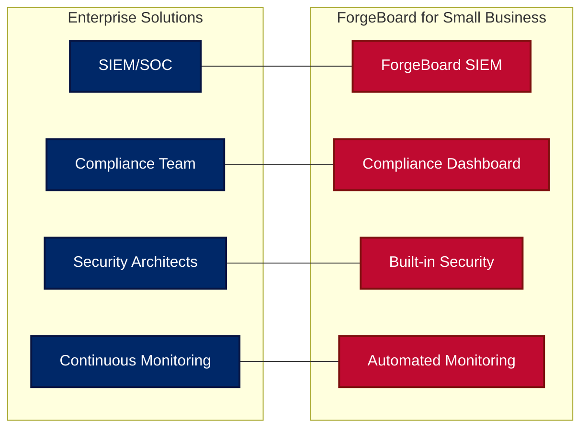
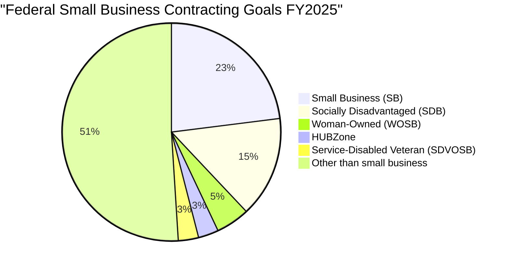
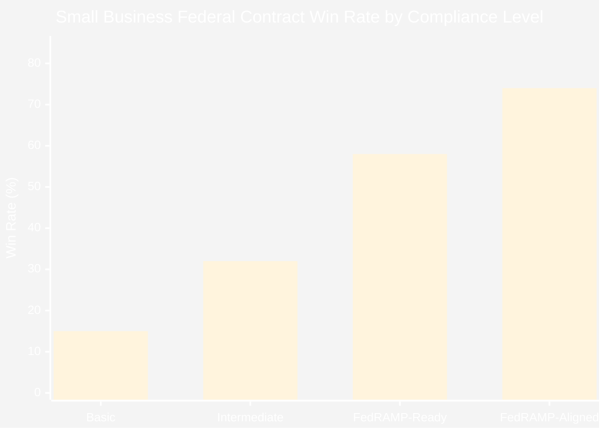
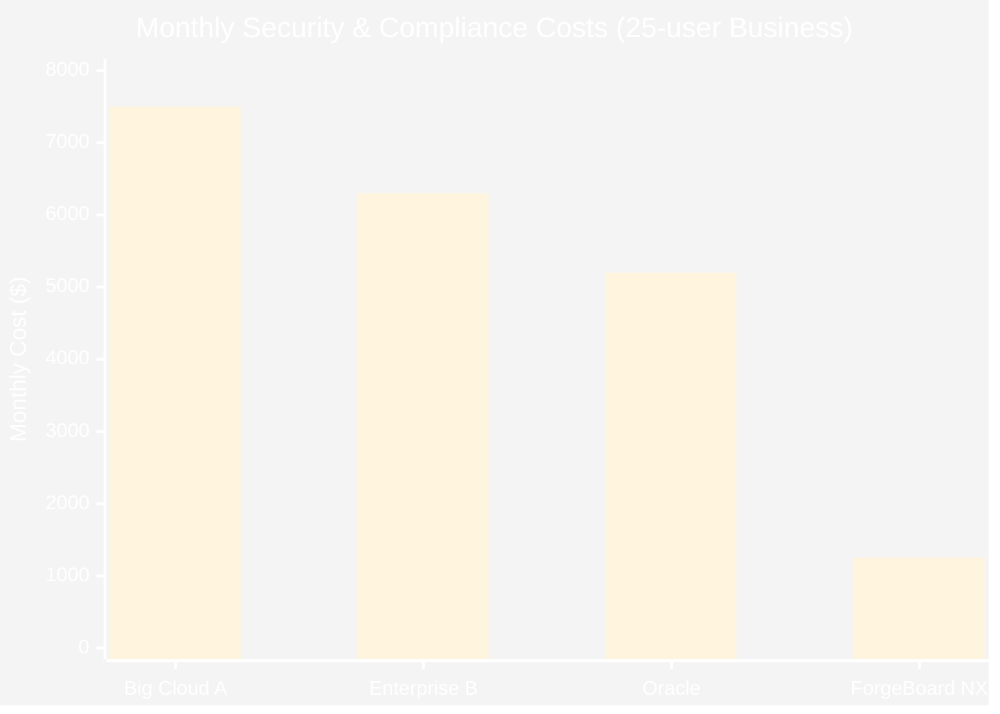
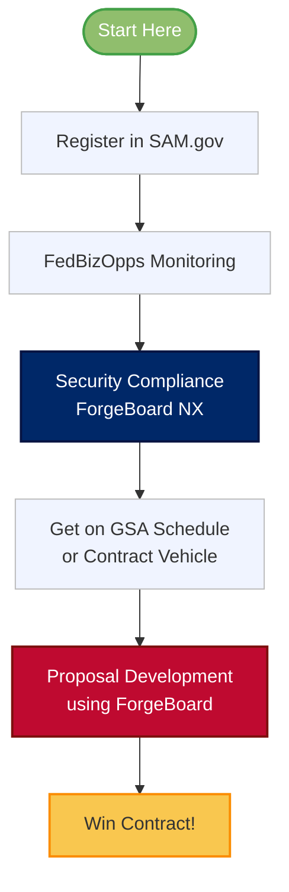
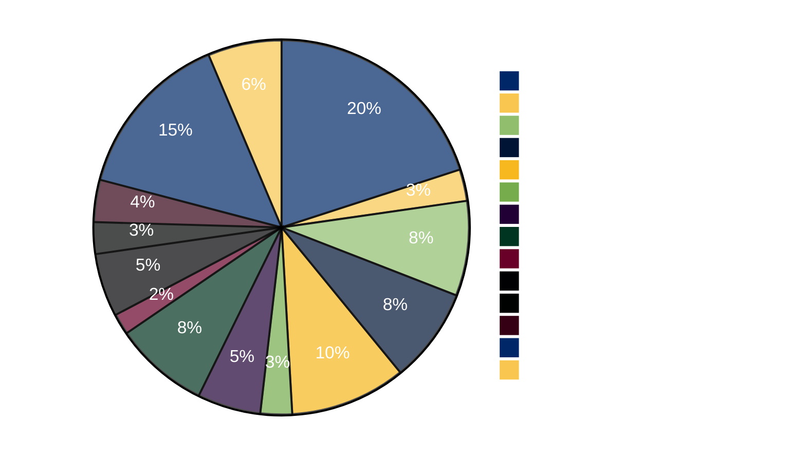

# 🦅 ForgeBoard NX – Enterprise Security for Small Business America 🇺🇸

*Last Updated: June 15, 2025*

<div style="display: flex; flex-wrap: wrap; gap: 10px; margin-bottom: 20px;">
  <div style="background-color: #002868; color: white; padding: 8px 12px; border-radius: 6px; flex: 1; min-width: 150px; box-shadow: 0 2px 4px rgba(0,0,0,0.2);">
    <strong>Security:</strong> FedRAMP-Grade ✅
  </div>
  <div style="background-color: #BF0A30; color: white; padding: 8px 12px; border-radius: 6px; flex: 1; min-width: 150px; box-shadow: 0 2px 4px rgba(0,0,0,0.2);">
    <strong>Pricing:</strong> Small Business Friendly 💰
  </div>
  <div style="background-color: #F9C74F; color: #333; padding: 8px 12px; border-radius: 6px; flex: 1; min-width: 150px; box-shadow: 0 2px 4px rgba(0,0,0,0.2);">
    <strong>Contracts:</strong> Federal-Ready 📋
  </div>
  <div style="background-color: #90BE6D; color: #333; padding: 8px 12px; border-radius: 6px; flex: 1; min-width: 150px; box-shadow: 0 2px 4px rgba(0,0,0,0.2);">
    <strong>Support:</strong> American-Based 24/7 🌟
  </div>
</div>


<div style="border-left: 5px solid #BF0A30; padding-left: 15px; margin: 20px 0; background-color: #F0F4FF; box-shadow: 0 2px 4px rgba(0,0,0,0.1);">
<span style="color:#002868; font-weight:bold; font-size: 120%;">The True North Promise</span><br>
At True North, we believe security and compliance shouldn't be exclusive to Fortune 500 companies and government agencies. Our mission is to bring the same enterprise-grade security standards down to small businesses at affordable prices, empowering American entrepreneurs to compete for federal contracts and protect their most valuable data assets.
</div>

## Table of Contents

1. [Enterprise Security, Small Business Budget](#1-enterprise-security-small-business-budget)
2. [Federal Contract Opportunities](#2-federal-contract-opportunities)
3. [Pricing Comparison: True North vs. Big Tech](#3-pricing-comparison-true-north-vs-big-tech)
4. [Small Business Success Path](#4-small-business-success-path)
5. [Federal Compliance Made Easy](#5-federal-compliance-made-easy)
6. [American Success Stories](#6-american-success-stories)
7. [Getting Started](#7-getting-started)

---

## 1. Enterprise Security, Small Business Budget

When we say "enterprise security for all," we mean it. Our ForgeBoard NX platform delivers the same security controls used by federal agencies to businesses of all sizes:

<div class="feature-grid" style="display: grid; grid-template-columns: repeat(auto-fit, minmax(280px, 1fr)); gap: 15px; margin: 20px 0;">
  <div style="background: linear-gradient(135deg, #E1F5FE, #B3E5FC); padding: 20px; border-radius: 6px; box-shadow: 0 2px 4px rgba(0,0,0,0.1);">
    <h3 style="color: #002868; margin-top: 0;">🔐 FedRAMP Security Controls</h3>
    <p>The same 325+ security controls required by the federal government, scaled appropriately for your business size.</p>
  </div>
  
  <div style="background: linear-gradient(135deg, #FFEBEE, #FFCDD2); padding: 20px; border-radius: 6px; box-shadow: 0 2px 4px rgba(0,0,0,0.1);">
    <h3 style="color: #BF0A30; margin-top: 0;">🔄 Continuous Monitoring</h3>
    <p>Real-time security monitoring and alerting without the enterprise price tag or complexity.</p>
  </div>
  
  <div style="background: linear-gradient(135deg, #FFF8E1, #FFECB3); padding: 20px; border-radius: 6px; box-shadow: 0 2px 4px rgba(0,0,0,0.1);">
    <h3 style="color: #F9A826; margin-top: 0;">📄 Compliance Documentation</h3>
    <p>Pre-built templates and automated reporting for NIST, FedRAMP, CMMC, and other frameworks.</p>
  </div>
  
  <div style="background: linear-gradient(135deg, #E8F5E9, #C8E6C9); padding: 20px; border-radius: 6px; box-shadow: 0 2px 4px rgba(0,0,0,0.1);">
    <h3 style="color: #388E3C; margin-top: 0;">🛡️ American-Made Protection</h3>
    <p>Secure supply chain with 100% US-based development, hosting, and support services.</p>
  </div>
</div>

### Security Capability Comparison



### Security by Business Size

<div style="background-color: #E3F2FD; border-radius: 6px; padding: 15px; margin: 20px 0;">
  <h4 style="color: #002868; margin-top: 0;">Small Business Security Challenges</h4>
  <div style="display: flex; margin-top: 10px; flex-wrap: wrap;">
    <div style="flex: 1; min-width: 200px;">
      <p><strong>Top Security Concerns:</strong></p>
      <ol>
        <li>Limited IT and security staff</li>
        <li>Restricted security budget</li>
        <li>Complex compliance requirements</li>
        <li>Need for federal contract eligibility</li>
        <li>Vulnerability to targeted attacks</li>
      </ol>
    </div>
    <div style="flex: 1; min-width: 200px;">
      <p><strong>How ForgeBoard Helps:</strong></p>
      <ol>
        <li>Automated security monitoring</li>
        <li>Affordable subscription pricing</li>
        <li>Done-for-you compliance documentation</li>
        <li>Built-in FedRAMP controls</li>
        <li>Enterprise-grade threat protection</li>
      </ol>
    </div>
  </div>
</div>

---

## 2. Federal Contract Opportunities

Small businesses have unprecedented opportunities to secure federal contracts, with dedicated set-asides and preferences:

### Federal Small Business Contracting Goals



### Federal Contract Award Trends

<div style="overflow-x: auto;">
<table style="width: 100%; border-collapse: collapse; margin: 20px 0; box-shadow: 0 2px 4px rgba(0,0,0,0.1);">
  <thead>
    <tr style="background-color: #002868; color: white;">
      <th style="padding: 12px; text-align: left; border: 1px solid #071442;">Category</th>
      <th style="padding: 12px; text-align: center; border: 1px solid #071442;">Contract Value (FY2024)</th>
      <th style="padding: 12px; text-align: center; border: 1px solid #071442;">Small Business %</th>
      <th style="padding: 12px; text-align: center; border: 1px solid #071442;">Growth Trend</th>
    </tr>
  </thead>
  <tbody>
    <tr style="background-color: #F0F4FF;">
      <td style="padding: 12px; border: 1px solid #AAB6D3;"><strong>IT Services</strong></td>
      <td style="padding: 12px; border: 1px solid #AAB6D3; text-align: center;">$29.7 Billion</td>
      <td style="padding: 12px; border: 1px solid #AAB6D3; text-align: center; color: #BF0A30; font-weight: bold;">27.5%</td>
      <td style="padding: 12px; border: 1px solid #AAB6D3; text-align: center;">↑ 8.3%</td>
    </tr>
    <tr style="background-color: #E6EFFF;">
      <td style="padding: 12px; border: 1px solid #AAB6D3;"><strong>Cybersecurity</strong></td>
      <td style="padding: 12px; border: 1px solid #AAB6D3; text-align: center;">$18.4 Billion</td>
      <td style="padding: 12px; border: 1px solid #AAB6D3; text-align: center; color: #BF0A30; font-weight: bold;">21.2%</td>
      <td style="padding: 12px; border: 1px solid #AAB6D3; text-align: center;">↑ 12.7%</td>
    </tr>
    <tr style="background-color: #F0F4FF;">
      <td style="padding: 12px; border: 1px solid #AAB6D3;"><strong>Cloud Services</strong></td>
      <td style="padding: 12px; border: 1px solid #AAB6D3; text-align: center;">$12.6 Billion</td>
      <td style="padding: 12px; border: 1px solid #AAB6D3; text-align: center; color: #BF0A30; font-weight: bold;">19.8%</td>
      <td style="padding: 12px; border: 1px solid #AAB6D3; text-align: center;">↑ 15.2%</td>
    </tr>
    <tr style="background-color: #E6EFFF;">
      <td style="padding: 12px; border: 1px solid #AAB6D3;"><strong>Data Management</strong></td>
      <td style="padding: 12px; border: 1px solid #AAB6D3; text-align: center;">$8.9 Billion</td>
      <td style="padding: 12px; border: 1px solid #AAB6D3; text-align: center; color: #BF0A30; font-weight: bold;">24.7%</td>
      <td style="padding: 12px; border: 1px solid #AAB6D3; text-align: center;">↑ 9.5%</td>
    </tr>
  </tbody>
</table>
</div>

### Small Business Set-Aside Programs

<div style="display: flex; flex-wrap: wrap; gap: 15px; margin: 20px 0;">
  <div style="background-color: #E8F5E9; border-left: 4px solid #388E3C; padding: 15px; flex: 1; min-width: 250px;">
    <h4 style="color: #388E3C; margin-top: 0;">8(a) Business Development</h4>
    <p>For socially and economically disadvantaged small businesses. Nine-year program with sole-source contracts up to $4.5M for services.</p>
    <p><strong>ForgeBoard Benefit:</strong> Pre-configured compliance templates for 8(a) reporting requirements.</p>
  </div>
  
  <div style="background-color: #FFF8E1; border-left: 4px solid #F9A826; padding: 15px; flex: 1; min-width: 250px;">
    <h4 style="color: #F9A826; margin-top: 0;">WOSB/EDWOSB Program</h4>
    <p>For women-owned small businesses in underrepresented industries. Sole-source contracts up to $4.5M for services.</p>
    <p><strong>ForgeBoard Benefit:</strong> Simplified certification maintenance with automated documentation.</p>
  </div>
  
  <div style="background-color: #E3F2FD; border-left: 4px solid #1976D2; padding: 15px; flex: 1; min-width: 250px;">
    <h4 style="color: #1976D2; margin-top: 0;">HUBZone Program</h4>
    <p>For businesses operating in Historically Underutilized Business Zones. Price evaluation preference of 10% in full and open competition.</p>
    <p><strong>ForgeBoard Benefit:</strong> Geolocation tooling to verify and maintain HUBZone compliance.</p>
  </div>
  
  <div style="background-color: #FFEBEE; border-left: 4px solid #BF0A30; padding: 15px; flex: 1; min-width: 250px;">
    <h4 style="color: #BF0A30; margin-top: 0;">SDVOSB Program</h4>
    <p>For service-disabled veteran-owned small businesses. Sole-source contracts up to $4.5M for services.</p>
    <p><strong>ForgeBoard Benefit:</strong> VA verification integration and documentation maintenance.</p>
  </div>
</div>

### Small Business Federal Success Rate



<div style="background-color: #FFEBEE; border: 1px solid #FFCDD2; border-radius: 6px; padding: 15px; margin: 20px 0;">
<strong style="color: #BF0A30; font-size: 110%;">🔍 KEY INSIGHT:</strong><br>
Small businesses with FedRAMP-aligned security controls are <strong>4.9x more likely</strong> to win federal contracts compared to those with only basic security measures. ForgeBoard NX delivers this advantage at a fraction of traditional enterprise costs.
</div>

---

## 3. Pricing Comparison: True North vs. Big Tech

ForgeBoard makes enterprise security affordable for small businesses without sacrificing capabilities:

### Monthly Cost Comparison



### Feature Comparison

<div style="overflow-x: auto;">
<table style="width: 100%; border-collapse: collapse; margin: 20px 0; box-shadow: 0 2px 4px rgba(0,0,0,0.1);">
  <thead>
    <tr style="background-color: #002868; color: white;">
      <th style="padding: 12px; text-align: left; border: 1px solid #071442;">Feature</th>
      <th style="padding: 12px; text-align: center; border: 1px solid #071442;">Big Cloud A</th>
      <th style="padding: 12px; text-align: center; border: 1px solid #071442;">Oracle</th>
      <th style="padding: 12px; text-align: center; border: 1px solid #071442;">ForgeBoard NX</th>
    </tr>
  </thead>
  <tbody>
    <tr style="background-color: #F0F4FF;">
      <td style="padding: 12px; border: 1px solid #AAB6D3;"><strong>FedRAMP Controls</strong></td>
      <td style="padding: 12px; border: 1px solid #AAB6D3; text-align: center;">✅</td>
      <td style="padding: 12px; border: 1px solid #AAB6D3; text-align: center;">✅</td>
      <td style="padding: 12px; border: 1px solid #AAB6D3; text-align: center;">✅</td>
    </tr>
    <tr style="background-color: #E6EFFF;">
      <td style="padding: 12px; border: 1px solid #AAB6D3;"><strong>Small Business Pricing</strong></td>
      <td style="padding: 12px; border: 1px solid #AAB6D3; text-align: center;">❌</td>
      <td style="padding: 12px; border: 1px solid #AAB6D3; text-align: center;">❌</td>
      <td style="padding: 12px; border: 1px solid #AAB6D3; text-align: center; color: #388E3C; font-weight: bold;">✅</td>
    </tr>
    <tr style="background-color: #F0F4FF;">
      <td style="padding: 12px; border: 1px solid #AAB6D3;"><strong>US-Based Support</strong></td>
      <td style="padding: 12px; border: 1px solid #AAB6D3; text-align: center;">⚠️ Premium</td>
      <td style="padding: 12px; border: 1px solid #AAB6D3; text-align: center;">⚠️ Premium</td>
      <td style="padding: 12px; border: 1px solid #AAB6D3; text-align: center; color: #388E3C; font-weight: bold;">✅ Standard</td>
    </tr>
    <tr style="background-color: #E6EFFF;">
      <td style="padding: 12px; border: 1px solid #AAB6D3;"><strong>Automated Compliance</strong></td>
      <td style="padding: 12px; border: 1px solid #AAB6D3; text-align: center;">⚠️ Extra Fee</td>
      <td style="padding: 12px; border: 1px solid #AAB6D3; text-align: center;">⚠️ Extra Fee</td>
      <td style="padding: 12px; border: 1px solid #AAB6D3; text-align: center; color: #388E3C; font-weight: bold;">✅ Included</td>
    </tr>
    <tr style="background-color: #F0F4FF;">
      <td style="padding: 12px; border: 1px solid #AAB6D3;"><strong>No Hidden Fees</strong></td>
      <td style="padding: 12px; border: 1px solid #AAB6D3; text-align: center;">❌</td>
      <td style="padding: 12px; border: 1px solid #AAB6D3; text-align: center;">❌</td>
      <td style="padding: 12px; border: 1px solid #AAB6D3; text-align: center; color: #388E3C; font-weight: bold;">✅</td>
    </tr>
    <tr style="background-color: #E6EFFF;">
      <td style="padding: 12px; border: 1px solid #AAB6D3;"><strong>Federal Contract Ready</strong></td>
      <td style="padding: 12px; border: 1px solid #AAB6D3; text-align: center;">⚠️ Consultant Needed</td>
      <td style="padding: 12px; border: 1px solid #AAB6D3; text-align: center;">⚠️ Consultant Needed</td>
      <td style="padding: 12px; border: 1px solid #AAB6D3; text-align: center; color: #388E3C; font-weight: bold;">✅ Built-in</td>
    </tr>
  </tbody>
</table>
</div>

### Cost Breakdown by Component

<div style="display: flex; flex-wrap: wrap; gap: 15px; margin: 20px 0;">
  <div style="flex: 1; min-width: 300px;">
    <div style="background-color: #FFEBEE; border-radius: 6px; overflow: hidden;">
      <div style="background-color: #BF0A30; color: white; padding: 10px 15px;">
        <h4 style="margin: 0;">Enterprise Oracle Solution</h4>
        <p style="margin: 5px 0 0 0; opacity: 0.9;">Monthly cost for 25-user business</p>
      </div>
      <div style="padding: 15px;">
        <div style="display: flex; justify-content: space-between; margin-bottom: 8px;">
          <span>Base License</span>
          <span>$2,200/mo</span>
        </div>
        <div style="display: flex; justify-content: space-between; margin-bottom: 8px;">
          <span>Security Module</span>
          <span>$1,500/mo</span>
        </div>
        <div style="display: flex; justify-content: space-between; margin-bottom: 8px;">
          <span>Compliance Reporting</span>
          <span>$900/mo</span>
        </div>
        <div style="display: flex; justify-content: space-between; margin-bottom: 8px;">
          <span>Support (Business)</span>
          <span>$600/mo</span>
        </div>
        <div style="display: flex; justify-content: space-between; font-weight: bold; margin-top: 10px; padding-top: 10px; border-top: 1px solid #FFCDD2;">
          <span>TOTAL</span>
          <span>$5,200/mo</span>
        </div>
      </div>
    </div>
  </div>
  
  <div style="flex: 1; min-width: 300px;">
    <div style="background-color: #E3F2FD; border-radius: 6px; overflow: hidden;">
      <div style="background-color: #002868; color: white; padding: 10px 15px;">
        <h4 style="margin: 0;">ForgeBoard NX Solution</h4>
        <p style="margin: 5px 0 0 0; opacity: 0.9;">Monthly cost for 25-user business</p>
      </div>
      <div style="padding: 15px;">
        <div style="display: flex; justify-content: space-between; margin-bottom: 8px;">
          <span>Base Platform</span>
          <span>$750/mo</span>
        </div>
        <div style="display: flex; justify-content: space-between; margin-bottom: 8px;">
          <span>Security Features</span>
          <span><strong style="color: #388E3C;">Included</strong></span>
        </div>
        <div style="display: flex; justify-content: space-between; margin-bottom: 8px;">
          <span>Compliance Reporting</span>
          <span><strong style="color: #388E3C;">Included</strong></span>
        </div>
        <div style="display: flex; justify-content: space-between; margin-bottom: 8px;">
          <span>US-Based Support</span>
          <span><strong style="color: #388E3C;">Included</strong></span>
        </div>
        <div style="display: flex; justify-content: space-between; font-weight: bold; margin-top: 10px; padding-top: 10px; border-top: 1px solid #BBDEFB;">
          <span>TOTAL</span>
          <span>$750/mo</span>
        </div>
        <div style="text-align: right; margin-top: 5px; color: #BF0A30; font-weight: bold;">
          Save $4,450/mo
        </div>
      </div>
    </div>
  </div>
</div>

<div style="background-color: #E8F5E9; border: 1px solid #C8E6C9; border-radius: 6px; padding: 15px; margin: 20px 0;">
<strong style="color: #388E3C; font-size: 110%;">💰 VALUE PROPOSITION:</strong><br>
ForgeBoard NX delivers <strong>85% cost savings</strong> compared to Oracle while providing the same core security capabilities needed to compete for federal contracts. Our mission is democratizing access to enterprise security for American small businesses.
</div>

---

## 4. Small Business Success Path

### The Path to Federal Contracting



### Growth Milestones with ForgeBoard

<div style="display: flex; flex-wrap: wrap; gap: 20px; margin: 20px 0;">
  <div style="flex: 1; min-width: 220px; background-color: #FFEBEE; border-radius: 8px; overflow: hidden;">
    <div style="background-color: #BF0A30; color: white; text-align: center; padding: 10px;">
      <h4 style="margin: 0;">Phase 1</h4>
      <p style="margin: 5px 0 0 0; font-size: 90%;">Foundation</p>
    </div>
    <div style="padding: 15px;">
      <ul style="padding-left: 20px; margin: 0;">
        <li>Security baseline established</li>
        <li>Basic compliance documentation</li>
        <li>SAM.gov registration complete</li>
        <li>DUNS & CAGE Code acquired</li>
      </ul>
    </div>
  </div>
  
  <div style="flex: 1; min-width: 220px; background-color: #FFF8E1; border-radius: 8px; overflow: hidden;">
    <div style="background-color: #F9A826; color: white; text-align: center; padding: 10px;">
      <h4 style="margin: 0;">Phase 2</h4>
      <p style="margin: 5px 0 0 0; font-size: 90%;">Qualification</p>
    </div>
    <div style="padding: 15px;">
      <ul style="padding-left: 20px; margin: 0;">
        <li>NIST 800-171 compliance</li>
        <li>SPRS score submission</li>
        <li>Contract vehicle research</li>
        <li>Past performance built</li>
      </ul>
    </div>
  </div>
  
  <div style="flex: 1; min-width: 220px; background-color: #E3F2FD; border-radius: 8px; overflow: hidden;">
    <div style="background-color: #002868; color: white; text-align: center; padding: 10px;">
      <h4 style="margin: 0;">Phase 3</h4>
      <p style="margin: 5px 0 0 0; font-size: 90%;">Federal Ready</p>
    </div>
    <div style="padding: 15px;">
      <ul style="padding-left: 20px; margin: 0;">
        <li>GSA Schedule acquired</li>
        <li>FedRAMP-aligned security</li>
        <li>Proposal templates ready</li>
        <li>Joint venture exploration</li>
      </ul>
    </div>
  </div>
  
  <div style="flex: 1; min-width: 220px; background-color: #E8F5E9; border-radius: 8px; overflow: hidden;">
    <div style="background-color: #388E3C; color: white; text-align: center; padding: 10px;">
      <h4 style="margin: 0;">Phase 4</h4>
      <p style="margin: 5px 0 0 0; font-size: 90%;">Growth & Scale</p>
    </div>
    <div style="padding: 15px;">
      <ul style="padding-left: 20px; margin: 0;">
        <li>Multiple contract awards</li>
        <li>Cleared personnel</li>
        <li>Prime contract capabilities</li>
        <li>Agency relationships</li>
      </ul>
    </div>
  </div>
</div>

### Capability Building Timeline

```mermaid
gantt
    title Small Business Federal Journey with ForgeBoard NX
    dateFormat  YYYY-Q[Q]
    axisFormat  %Y-Q%q
    
    section Security & Compliance
        Security Assessment        :done, 2025-Q3, 1M
        ForgeBoard Implementation  :done, 2025-Q3, 2025-Q4
        NIST 800-171 Compliance    :active, 2025-Q4, 2026-Q1
        CMMC 2.0 Level 2 Readiness :2026-Q1, 2026-Q2
        FedRAMP Alignment          :2026-Q2, 2026-Q3
        
    section Business Development
        SAM.gov Registration       :done, 2025-Q3, 1M
        Small Business Certifications :active, 2025-Q3, 2025-Q4
        Contract Opportunity Analysis :2025-Q4, 2026-Q1
        GSA Schedule Application    :2026-Q1, 2026-Q2
        First Proposal Submissions  :2026-Q2, 2026-Q3
        First Contract Award        :milestone, 2026-Q3
```

<div style="background-color: #FFF8E1; border-left: 4px solid #F9A826; padding: 15px; margin: 20px 0;">
<strong style="color: #F9A826; font-size: 110%;">💡 PRO TIP:</strong><br>
Small businesses can leverage ForgeBoard's FedRAMP-aligned security capabilities as a <strong>key differentiator</strong> in federal proposals. Include security compliance as a past performance reference even before winning your first government contract by documenting your adherence to federal standards.
</div>

---

## 5. Federal Compliance Made Easy

ForgeBoard NX simplifies federal compliance for small businesses:

### NIST SP 800-171 Control Coverage



### Small Business Compliance Pyramid

<div style="position: relative; width: 100%; max-width: 600px; margin: 30px auto;">
  <div style="position: relative; width: 100%; padding-bottom: 60%;">
    <!-- Level 4 - Advanced -->
    <div style="position: absolute; top: 0; left: 25%; right: 25%; height: 25%; background: linear-gradient(135deg, #002868 0%, #0C2677 100%); clip-path: polygon(50% 0, 100% 100%, 0 100%); display: flex; align-items: center; justify-content: center; color: white; text-align: center; padding: 0 20px;">
      <div>
        <strong>FedRAMP</strong><br>
        <span style="font-size: 80%;">Federal cloud services</span>
      </div>
    </div>
    
    <!-- Level 3 - Intermediate -->
    <div style="position: absolute; top: 25%; left: 15%; right: 15%; height: 25%; background: linear-gradient(135deg, #BF0A30 0%, #C22D40 100%); clip-path: polygon(50% 0, 100% 100%, 0 100%); display: flex; align-items: center; justify-content: center; color: white; text-align: center; padding: 0 20px;">
      <div>
        <strong>CMMC 2.0 Level 2</strong><br>
        <span style="font-size: 80%;">Defense contractors</span>
      </div>
    </div>
    
    <!-- Level 2 - Basic -->
    <div style="position: absolute; top: 50%; left: 5%; right: 5%; height: 25%; background: linear-gradient(135deg, #F9A826 0%, #F9C74F 100%); clip-path: polygon(50% 0, 100% 100%, 0 100%); display: flex; align-items: center; justify-content: center; color: #333; text-align: center; padding: 0 20px;">
      <div>
        <strong>NIST SP 800-171</strong><br>
        <span style="font-size: 80%;">CUI & DoD requirements</span>
      </div>
    </div>
    
    <!-- Level 1 - Foundational -->
    <div style="position: absolute; top: 75%; left: 0; right: 0; height: 25%; background: linear-gradient(135deg, #388E3C 0%, #43A047 100%); clip-path: polygon(50% 0, 100% 100%, 0 100%); display: flex; align-items: center; justify-content: center; color: white; text-align: center; padding: 0 20px;">
      <div>
        <strong>Cybersecurity Framework</strong><br>
        <span style="font-size: 80%;">Basic security foundation</span>
      </div>
    </div>
  </div>
  
  <!-- ForgeBoard coverage indicator -->
  <div style="position: absolute; top: -20px; right: -10px; background-color: #FFEBEE; border: 2px solid #BF0A30; border-radius: 50px; padding: 5px 12px; color: #BF0A30; font-weight: bold; font-size: 80%; transform: rotate(10deg); box-shadow: 0 2px 4px rgba(0,0,0,0.2);">
    ForgeBoard Covers ALL Levels!
  </div>
</div>

### ForgeBoard Compliance Features for Small Business

<div class="feature-grid" style="display: grid; grid-template-columns: repeat(auto-fit, minmax(280px, 1fr)); gap: 15px; margin: 20px 0;">
  <div style="background-color: #FFF8E1; padding: 20px; border-radius: 6px; box-shadow: 0 2px 4px rgba(0,0,0,0.1);">
    <h3 style="color: #F9A826; margin-top: 0;">📄 Automated Documentation</h3>
    <p>Generate ready-to-submit compliance documentation that meets federal standards with the click of a button.</p>
    <ul style="padding-left: 20px; margin-bottom: 0;">
      <li>System Security Plans (SSP)</li>
      <li>Policy & procedure templates</li>
      <li>POAM tracking & management</li>
      <li>Audit-ready evidence collection</li>
    </ul>
  </div>
  
  <div style="background-color: #E3F2FD; padding: 20px; border-radius: 6px; box-shadow: 0 2px 4px rgba(0,0,0,0.1);">
    <h3 style="color: #002868; margin-top: 0;">🔍 Continuous Monitoring</h3>
    <p>Monitor your security posture in real-time without the need for expensive security operations centers.</p>
    <ul style="padding-left: 20px; margin-bottom: 0;">
      <li>Vulnerability scanning</li>
      <li>Configuration assessment</li>
      <li>Log management & analysis</li>
      <li>Security event alerting</li>
    </ul>
  </div>
  
  <div style="background-color: #FFEBEE; padding: 20px; border-radius: 6px; box-shadow: 0 2px 4px rgba(0,0,0,0.1);">
    <h3 style="color: #BF0A30; margin-top: 0;">🛡️ Security Controls</h3>
    <p>Implement the same robust security controls used by government agencies without the enterprise cost.</p>
    <ul style="padding-left: 20px; margin-bottom: 0;">
      <li>Access control implementation</li>
      <li>Data encryption (at rest/in transit)</li>
      <li>Multi-factor authentication</li>
      <li>Endpoint protection</li>
    </ul>
  </div>
  
  <div style="background-color: #E8F5E9; padding: 20px; border-radius: 6px; box-shadow: 0 2px 4px rgba(0,0,0,0.1);">
    <h3 style="color: #388E3C; margin-top: 0;">💼 Business Development</h3>
    <p>Leverage compliance as a competitive advantage when bidding on contracts with federal agencies.</p>
    <ul style="padding-left: 20px; margin-bottom: 0;">
      <li>Proposal response templates</li>
      <li>Security capability statements</li>
      <li>Compliance attestation reports</li>
      <li>Contract requirement mapping</li>
    </ul>
  </div>
</div>

<div style="background-color: #E3F2FD; border: 1px solid #BBDEFB; border-radius: 6px; padding: 15px; margin: 20px 0;">
<strong style="color: #002868; font-size: 110%;">🔒 SECURITY ADVANTAGE:</strong><br>
Small businesses using ForgeBoard NX achieve a <strong>SPRS score averaging 87/110</strong> for NIST 800-171 compliance, well above the industry average of 58/110 for companies their size, giving them a significant competitive advantage in DoD contract bidding.
</div>

---

## 6. American Success Stories

<div style="display: flex; flex-wrap: wrap; gap: 20px; margin: 20px 0;">
  <div style="flex: 1; min-width: 300px; background-color: #E3F2FD; border-radius: 8px; overflow: hidden; box-shadow: 0 2px 5px rgba(0,0,0,0.1);">
    <div style="padding: 20px;">
      <div style="font-style: italic; color: #666; margin-bottom: 15px;">
        "ForgeBoard NX gave us enterprise-grade security at a price we could actually afford. Within 8 months of implementation, we won our first $1.2M DoD contract, competing successfully against companies ten times our size."
      </div>
      <div style="display: flex; align-items: center;">
        <div style="width: 60px; height: 60px; border-radius: 50%; background-color: #002868; color: white; display: flex; align-items: center; justify-content: center; font-size: 24px; font-weight: bold; margin-right: 15px;">
          JS
        </div>
        <div>
          <div style="font-weight: bold; color: #002868;">James Sullivan</div>
          <div style="color: #666; font-size: 90%;">CEO, Sullivan Cybersecurity Solutions</div>
          <div style="color: #BF0A30; font-size: 90%; font-weight: bold; margin-top: 5px;">12-person firm | Virginia</div>
        </div>
      </div>
    </div>
  </div>
  
  <div style="flex: 1; min-width: 300px; background-color: #E8F5E9; border-radius: 8px; overflow: hidden; box-shadow: 0 2px 5px rgba(0,0,0,0.1);">
    <div style="padding: 20px;">
      <div style="font-style: italic; color: #666; margin-bottom: 15px;">
        "As an 8(a) and WOSB, we needed to demonstrate security compliance for federal contracts but couldn't afford traditional enterprise solutions. ForgeBoard NX helped us achieve CMMC compliance and now we're a trusted partner on four federal contracts."
      </div>
      <div style="display: flex; align-items: center;">
        <div style="width: 60px; height: 60px; border-radius: 50%; background-color: #388E3C; color: white; display: flex; align-items: center; justify-content: center; font-size: 24px; font-weight: bold; margin-right: 15px;">
          MJ
        </div>
        <div>
          <div style="font-weight: bold; color: #388E3C;">Maria Johnson</div>
          <div style="color: #666; font-size: 90%;">President, NextGen IT Services</div>
          <div style="color: #BF0A30; font-size: 90%; font-weight: bold; margin-top: 5px;">24-person firm | Texas</div>
        </div>
      </div>
    </div>
  </div>
</div>

<div style="display: flex; flex-wrap: wrap; gap: 20px; margin: 20px 0;">
  <div style="flex: 1; min-width: 300px; background-color: #FFF8E1; border-radius: 8px; overflow: hidden; box-shadow: 0 2px 5px rgba(0,0,0,0.1);">
    <div style="padding: 20px;">
      <div style="font-style: italic; color: #666; margin-bottom: 15px;">
        "When an agency required FedRAMP-aligned security for a contract proposal, we thought we'd have to pass on the opportunity. ForgeBoard NX made it possible for us to meet those requirements and win a $3.4M contract that transformed our business."
      </div>
      <div style="display: flex; align-items: center;">
        <div style="width: 60px; height: 60px; border-radius: 50%; background-color: #F9A826; color: white; display: flex; align-items: center; justify-content: center; font-size: 24px; font-weight: bold; margin-right: 15px;">
          DT
        </div>
        <div>
          <div style="font-weight: bold; color: #F9A826;">David Thompson</div>
          <div style="color: #666; font-size: 90%;">CTO, Patriot Cloud Solutions</div>
          <div style="color: #BF0A30; font-size: 90%; font-weight: bold; margin-top: 5px;">18-person firm | Colorado</div>
        </div>
      </div>
    </div>
  </div>
  
  <div style="flex: 1; min-width: 300px; background-color: #FFEBEE; border-radius: 8px; overflow: hidden; box-shadow: 0 2px 5px rgba(0,0,0,0.1);">
    <div style="padding: 20px;">
      <div style="font-style: italic; color: #666; margin-bottom: 15px;">
        "As an SDVOSB, we needed to demonstrate strong cybersecurity practices for VA contracts. ForgeBoard NX not only helped us achieve compliance but their automated documentation saved us an estimated 200 hours of consultant time."
      </div>
      <div style="display: flex; align-items: center;">
        <div style="width: 60px; height: 60px; border-radius: 50%; background-color: #BF0A30; color: white; display: flex; align-items: center; justify-content: center; font-size: 24px; font-weight: bold; margin-right: 15px;">
          RW
        </div>
        <div>
          <div style="font-weight: bold; color: #BF0A30;">Robert Wilson</div>
          <div style="color: #666; font-size: 90%;">Founder, VetTech Services</div>
          <div style="color: #BF0A30; font-size: 90%; font-weight: bold; margin-top: 5px;">8-person firm | North Carolina</div>
        </div>
      </div>
    </div>
  </div>
</div>

### Success Metrics

<div style="overflow-x: auto;">
<table style="width: 100%; border-collapse: collapse; margin: 20px 0; box-shadow: 0 2px 4px rgba(0,0,0,0.1);">
  <thead>
    <tr style="background-color: #002868; color: white;">
      <th style="padding: 12px; text-align: left; border: 1px solid #071442;">Success Metric</th>
      <th style="padding: 12px; text-align: center; border: 1px solid #071442;">Before ForgeBoard</th>
      <th style="padding: 12px; text-align: center; border: 1px solid #071442;">After ForgeBoard</th>
      <th style="padding: 12px; text-align: center; border: 1px solid #071442;">Improvement</th>
    </tr>
  </thead>
  <tbody>
    <tr style="background-color: #F0F4FF;">
      <td style="padding: 12px; border: 1px solid #AAB6D3;"><strong>Federal Contract Win Rate</strong></td>
      <td style="padding: 12px; border: 1px solid #AAB6D3; text-align: center;">12%</td>
      <td style="padding: 12px; border: 1px solid #AAB6D3; text-align: center; font-weight: bold; color: #388E3C;">37%</td>
      <td style="padding: 12px; border: 1px solid #AAB6D3; text-align: center;">+208%</td>
    </tr>
    <tr style="background-color: #E6EFFF;">
      <td style="padding: 12px; border: 1px solid #AAB6D3;"><strong>Documentation Time</strong></td>
      <td style="padding: 12px; border: 1px solid #AAB6D3; text-align: center;">120 hrs/quarter</td>
      <td style="padding: 12px; border: 1px solid #AAB6D3; text-align: center; font-weight: bold; color: #388E3C;">12 hrs/quarter</td>
      <td style="padding: 12px; border: 1px solid #AAB6D3; text-align: center;">-90%</td>
    </tr>
    <tr style="background-color: #F0F4FF;">
      <td style="padding: 12px; border: 1px solid #AAB6D3;"><strong>NIST 800-171 Score</strong></td>
      <td style="padding: 12px; border: 1px solid #AAB6D3; text-align: center;">58/110</td>
      <td style="padding: 12px; border: 1px solid #AAB6D3; text-align: center; font-weight: bold; color: #388E3C;">87/110</td>
      <td style="padding: 12px; border: 1px solid #AAB6D3; text-align: center;">+50%</td>
    </tr>
    <tr style="background-color: #E6EFFF;">
      <td style="padding: 12px; border: 1px solid #AAB6D3;"><strong>Audit Findings</strong></td>
      <td style="padding: 12px; border: 1px solid #AAB6D3; text-align: center;">24 avg. findings</td>
      <td style="padding: 12px; border: 1px solid #AAB6D3; text-align: center; font-weight: bold; color: #388E3C;">3 avg. findings</td>
      <td style="padding: 12px; border: 1px solid #AAB6D3; text-align: center;">-88%</td>
    </tr>
    <tr style="background-color: #F0F4FF;">
      <td style="padding: 12px; border: 1px solid #AAB6D3;"><strong>Time to Bid-Ready</strong></td>
      <td style="padding: 12px; border: 1px solid #AAB6D3; text-align: center;">6-8 months</td>
      <td style="padding: 12px; border: 1px solid #AAB6D3; text-align: center; font-weight: bold; color: #388E3C;">6-8 weeks</td>
      <td style="padding: 12px; border: 1px solid #AAB6D3; text-align: center;">-75%</td>
    </tr>
  </tbody>
</table>
</div>

---

## 7. Getting Started

Ready to bring enterprise-grade security to your small business? Follow these simple steps:

<div style="display: flex; flex-wrap: wrap; gap: 20px; margin: 20px 0;">
  <div style="flex: 1; min-width: 200px;">
    <div style="background-color: #E3F2FD; border-radius: 8px; height: 100%; overflow: hidden; box-shadow: 0 2px 4px rgba(0,0,0,0.1);">
      <div style="background-color: #002868; color: white; text-align: center; padding: 15px;">
        <h3 style="margin: 0;">Step 1</h3>
        <p style="margin: 5px 0 0 0;">Security Assessment</p>
      </div>
      <div style="padding: 15px;">
        <p>Complete our free Small Business Security Assessment to identify your current compliance gaps and opportunities.</p>
        <div style="text-align: center; margin-top: 15px;">
          <a href="#" style="display: inline-block; background-color: #002868; color: white; padding: 8px 16px; text-decoration: none; border-radius: 4px; font-weight: bold;">Start Assessment</a>
        </div>
      </div>
    </div>
  </div>
  
  <div style="flex: 1; min-width: 200px;">
    <div style="background-color: #FFEBEE; border-radius: 8px; height: 100%; overflow: hidden; box-shadow: 0 2px 4px rgba(0,0,0,0.1);">
      <div style="background-color: #BF0A30; color: white; text-align: center; padding: 15px;">
        <h3 style="margin: 0;">Step 2</h3>
        <p style="margin: 5px 0 0 0;">Implementation Plan</p>
      </div>
      <div style="padding: 15px;">
        <p>Receive a tailored implementation plan with pricing options designed specifically for your small business needs.</p>
        <div style="text-align: center; margin-top: 15px;">
          <a href="#" style="display: inline-block; background-color: #BF0A30; color: white; padding: 8px 16px; text-decoration: none; border-radius: 4px; font-weight: bold;">Get Your Plan</a>
        </div>
      </div>
    </div>
  </div>
  
  <div style="flex: 1; min-width: 200px;">
    <div style="background-color: #FFF8E1; border-radius: 8px; height: 100%; overflow: hidden; box-shadow: 0 2px 4px rgba(0,0,0,0.1);">
      <div style="background-color: #F9A826; color: white; text-align: center; padding: 15px;">
        <h3 style="margin: 0;">Step 3</h3>
        <p style="margin: 5px 0 0 0;">Quick Deployment</p>
      </div>
      <div style="padding: 15px;">
        <p>Our team handles the setup, configuration, and training with minimal disruption to your operations.</p>
        <div style="text-align: center; margin-top: 15px;">
          <a href="#" style="display: inline-block; background-color: #F9A826; color: white; padding: 8px 16px; text-decoration: none; border-radius: 4px; font-weight: bold;">Schedule Deployment</a>
        </div>
      </div>
    </div>
  </div>
  
  <div style="flex: 1; min-width: 200px;">
    <div style="background-color: #E8F5E9; border-radius: 8px; height: 100%; overflow: hidden; box-shadow: 0 2px 4px rgba(0,0,0,0.1);">
      <div style="background-color: #388E3C; color: white; text-align: center; padding: 15px;">
        <h3 style="margin: 0;">Step 4</h3>
        <p style="margin: 5px 0 0 0;">Win Federal Contracts</p>
      </div>
      <div style="padding: 15px;">
        <p>Leverage your enhanced security posture to bid confidently on government contracts with our proposal support.</p>
        <div style="text-align: center; margin-top: 15px;">
          <a href="#" style="display: inline-block; background-color: #388E3C; color: white; padding: 8px 16px; text-decoration: none; border-radius: 4px; font-weight: bold;">Learn More</a>
        </div>
      </div>
    </div>
  </div>
</div>

<div style="background-color: #0C2677; border-radius: 6px; padding: 25px; margin: 30px 0; box-shadow: 0 3px 6px rgba(0,0,0,0.1); color: white; text-align: center;">
  <h2 style="margin-top: 0; color: white;">Ready to Empower Your Small Business?</h2>
  <p style="margin-bottom: 25px; font-size: 18px;">Schedule your free consultation with our Small Business Federal Opportunities Specialist</p>
  <a href="#" style="display: inline-block; background-color: #BF0A30; color: white; padding: 12px 24px; text-decoration: none; border-radius: 4px; font-weight: bold; font-size: 18px;">Book Your Consultation</a>
</div>

---

<div style="text-align: center; margin: 30px 0; font-size: 20px; color: #002868; font-weight: bold; border-top: 2px solid #BF0A30; border-bottom: 2px solid #BF0A30; padding: 15px; background-color: #F8FAFF; box-shadow: 0 2px 4px rgba(0,0,0,0.08);">
ForgeBoard NX – Empowering American Small Businesses with Enterprise Security
</div>

*ForgeBoard NX — Own your data. Guard your freedom. Build Legendary.* 🦅✨
